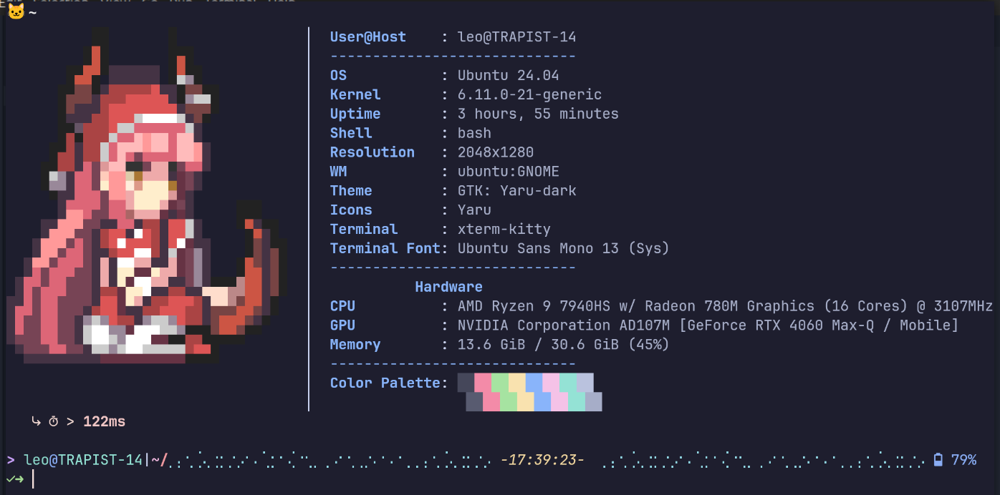
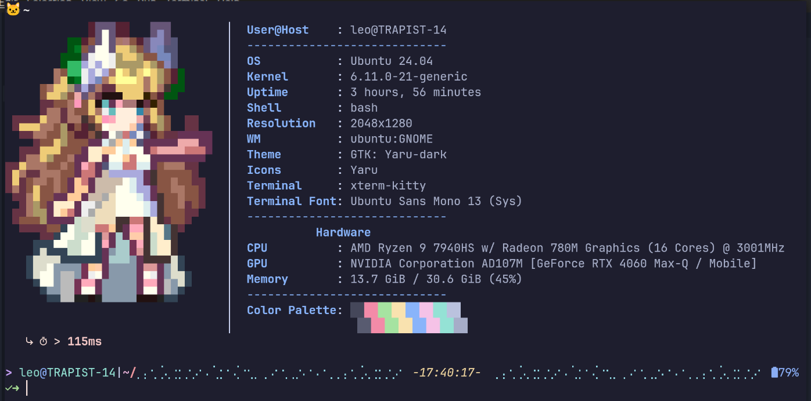
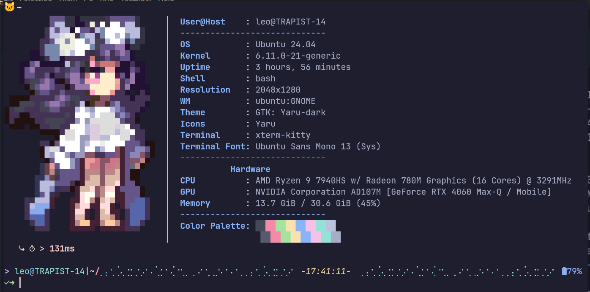

# <div align="center"> RW-fetch 
</div>  

Welcome to **RW-fetch** – your terminal’s nostalgic gateway to the pixel art of *Revived Witch*! This project converts GIFs and other images (with a focus on those from the gacha game *Revived Witch*, which has sadly reached its end of service) into vibrant ANSI art for your terminal. Enjoy a blast from the past, optionally displayed alongside your system information, every time you open your shell!

_Distributed under the [CC BY-NC-SA](https://creativecommons.org/licenses/by-nc-sa/4.0/) license._

## Table of Contents 📚

- [Overview 🌟](#overview-)
- [Screenshots 📸](#screenshots-)
- [Features ✨](#features-)
- [Installation 🛠️](#installation-)
  - [Python Version](#python-version)
  - [Rust Version (Optional Speedup)](#rust-version-optional-speedup)
- [Get Started 🚀](#get-started-)
  - [Adding New Images/GIFs 📁](#adding-new-imagesgifs-)
  - [Generating the Cache ⚡](#generating-the-cache-)
  - [Basic Display Commands (Python) 💻](#basic-display-commands-python-)
- [Usage Details ⚙️](#usage-details-)
  - [Cache Management 💾](#cache-management-)
    - [Cache Purging Utility](#cache-purging-utility-)
  - [Image Categorization & Thresholds 📏](#image-categorization--thresholds-)
  - [Displaying Random Images 🎲](#displaying-random-images-)
  - [System Information Display 📊](#system-information-display-)
- [Examples (Python Script) 🔍](#examples-python-script-)
- [Parameters Explained (Python Script) 🎛️](#parameters-explained-python-script-%EF%B8%8F)
- [Terminal Startup Integration ⏰](#terminal-startup-integration-)
  - [Using the Python Script](#using-the-python-script)
  - [Using the Rust Version](#using-the-rust-version)
- [Contributing 🤝](#contributing-)
- [License 📄](#license-)

## Overview 🌟

RW-fetch primarily consists of a Python script designed to:

1.  **Convert Images:** Transform static images and animated GIFs (like those from *Revived Witch*) into ANSI escape sequences suitable for display in modern terminals. It uses the half-block character (`▀`) technique for higher vertical resolution and attempts to preserve transparency.
2.  **Display Art:** Render the generated ANSI art directly in your terminal.
3.  **Show System Info:** Optionally fetch and display key system statistics alongside the artwork, using Python APIs where possible for speed and portability, and falling back to shell commands for harder-to-get information.
4.  **Cache Results:** Store the generated ANSI art and image metadata in a JSON cache file (`cache.json` by default) to significantly speed up subsequent displays, especially for random selections.
5.  **Categorize & Filter:** Classify images based on the height of their ANSI art ("small", "medium", "large", "extra-large") and allow filtering based on these categories.

Additionally, an **optional Rust version** is provided, focused *specifically* on fast display of random art with system info, ideal for reducing shell startup times compared to initializing Python/Conda.

The project aims to be a fun, visually appealing, and informative addition to your terminal environment.

## Screenshots 📸






## Features ✨

*(Refers mainly to the primary `rw_fetch.py` script)*

*   **Image to ANSI Conversion:** Renders images (PNG, GIF, JPG, WEBP, BMP) as ANSI art using 24-bit color escape codes.
*   **Animated GIF Support:** Selects a random frame from animated GIFs for conversion.
*   **Transparency & Cropping:** Handles transparent backgrounds and automatically crops transparent borders before conversion.
*   **Efficient Caching:** Stores generated ANSI art and metadata (category, line count) in a JSON file (`cache.json`) for fast subsequent access. Uses `orjson` if available for faster JSON processing.
*   **Image Categorization:** Automatically categorizes images into `small`, `medium`, `large`, or `extra-large` based on the generated ANSI art height (configurable thresholds in `config.py`).
*   **System Information:** Fetches and displays system info (OS, Kernel, Uptime, CPU, Memory, etc.).
    *   Prioritizes Python APIs (`platform`, `psutil`, `socket`, etc.) for speed and reliability.
    *   Uses `psutil` (optional dependency) for detailed CPU usage, Memory usage, and accurate Uptime.
    *   Provides configurable shell command fallbacks (in `config.py`) for information not easily accessible via Python (e.g., Packages, WM, GPU, Theme).
    *   System info layout and content are configurable via `config.py`.
*   **Filtering:** Allows displaying images based on specific categories (`--small`, `--medium`, etc.), useful with `--random` or when processing a directory.
*   **Random Display:** Selects and displays a random image from the cache (`--random`), respecting category filters if applied.
*   **Configurable:** Key settings like paths, category thresholds, system info order/commands, and colors are managed in `config.py`.
*   **Cross-Platform:** Primarily Python-based, aiming for compatibility across Linux, macOS, and potentially WSL. Note that some fallback shell commands for system info might be OS-specific.
*   **Silent Mode:** Suppresses informational messages (`--silent`) for cleaner output, ideal for terminal startup scripts.
*   **Cache Purging:** Includes a separate `purge_cache.py` script to remove entries by category.

## Installation 🛠️

### Python Version

1.  **Prerequisites:**
    *   Python 3.6 or later.
    *   `pip` (Python package installer).

2.  **Clone the Repository:**
    ```bash
    # Replace with the actual repo URL if different
    git clone https://github.com/lele394/RW-fetch.git
    cd RW-fetch
    ```

3.  **Install Required Python Dependencies:**
    *   **Pillow (PIL Fork):** For image processing.
    ```bash
    pip install Pillow
    ```

4.  **Install Recommended Python Dependencies (Optional but highly suggested):**
    *   **psutil:** Provides more accurate and detailed system information (CPU Usage, Memory, Uptime) reliably across platforms.
    *   **orjson:** Offers significantly faster JSON parsing and serialization, speeding up cache loading/saving.
    ```bash
    pip install psutil orjson
    ```
    *(See Features section for behavior if these are not installed)*

5.  **System Dependencies (for Fallback Commands):**
    *   Some system information items in `rw_fetch.py` rely on external commands (defined in `config.py`). You might need to install tools like `lspci`, `xrandr`, `wmctrl`, `gsettings`, `kreadconfig5`, `jq`, `system_profiler`, `dpkg-query`, `rpm`, `snap`, `flatpak` depending on your OS and desired info.

6.  **Make Scripts Executable (Optional):**
    ```bash
    chmod +x rw_fetch.py purge_cache.py
    ```

### Rust Version (Optional Speedup)

If you want the fastest possible startup for displaying a random image with sysinfo (e.g., for your shell prompt) and wish to avoid Python/Conda initialization overhead:

1.  **Prerequisites:**
    *   **Rust Toolchain:** Install Rust and Cargo (usually via `rustup`). Visit [rust-lang.org](https://www.rust-lang.org/).
    *   **Generated Cache:** You *must* first generate a `cache.json` file using the Python script (`./rw_fetch.py`). The Rust version only reads the cache.

2.  **Compile:**
    *   Use the provided compilation script, which includes optimizations for speed:
        ```bash
        ./compile_fast.sh
        ```
    *   This script will build the Rust project using `cargo build --release` with flags like `-C target-cpu=native` (optimizing for your current CPU, potentially breaking portability to older CPUs) and recommended settings in `Cargo.toml`.
    *   It will attempt to copy the final optimized executable to `./bin/rw_fetch_rs`.

3.  **Make Executable (If needed):** The compile script usually handles this, but if you build manually:
    ```bash
    chmod +x ./bin/rw_fetch_rs
    # Or use the path inside target/release/ if you didn't use the script
    # chmod +x ./target/release/rw_fetch_rs
    ```

## Get Started 🚀

This section focuses on the primary Python script. See [Using the Rust Version](#using-the-rust-version) for the compiled alternative.

### Adding New Images/GIFs 📁

*   By default, `rw_fetch.py` looks for images in `./rsc/`.
*   Place your `.gif`, `.png`, `.jpg`, `.webp`, or `.bmp` files inside the `rsc/` directory.
*   Use `--rsc-dir <path>` to specify a different image source.

### Generating the Cache ⚡

*   The cache (`cache.json`) stores pre-converted ANSI art for speed.
*   **Generate/update the cache using the Python script:**
    ```bash
    ./rw_fetch.py
    # Or: python rw_fetch.py
    ```
*   This processes all images in the `rsc/` directory (or specified `--rsc-dir`), displays them (unless `--silent`), and saves to `cache.json`. Do this initially and whenever images are added/removed or need refreshing (`--refresh`).

### Basic Display Commands (Python) 💻

*   **Display a specific image:**
    ```bash
    ./rw_fetch.py rsc/your_favorite.gif
    ```
*   **Display a random image from the cache:**
    ```bash
    ./rw_fetch.py --random
    ```
*   **Display a random image with system info:**
    ```bash
    ./rw_fetch.py --random --sysinfo
    ```
*   **Display a random *small* image, with system info, silently (ideal for startup):**
    ```bash
    ./rw_fetch.py --random --small --sysinfo --silent
    ```

## Usage Details ⚙️

*(Refers mainly to the primary `rw_fetch.py` script)*

### Cache Management 💾

*   **Cache File:** Default `./cache.json`. Use `--cache <path>` to change.
*   **Automatic Caching:** Uses cache if valid entry exists, otherwise processes image and updates cache.
*   **Forcing Refresh:** `--refresh` ignores cache and reprocesses.
    ```bash
    ./rw_fetch.py --refresh # Reprocess all in rsc/
    ./rw_fetch.py rsc/image.png --refresh # Reprocess one file
    ```
*   **Viewing Cache Info:** `--cache-info` shows statistics.
    ```bash
    ./rw_fetch.py --cache-info
    ```
*   **Purging Cache by Category:** Use the separate `purge_cache.py` script (see below).

#### Cache Purging Utility (`purge_cache.py`) 🧹

A utility script, `purge_cache.py`, is included to remove all cache entries belonging to a specific category.

**How it Works:**

1.  Loads the cache (`cache.json` or specified by `--cache`).
2.  Filters out entries matching the specified category (case-insensitive).
3.  Creates a backup (`.bak` file) by default (`--no-backup` to disable).
4.  Saves the filtered cache back to the original file.
5.  Reports a summary.

**Usage Example:**

```bash
# Remove all 'medium' entries from cache.json
./purge_cache.py medium

# Remove 'extra-large' entries without backup
./purge_cache.py extra-large --no-backup
```

### Image Categorization & Thresholds 📏

*   Images categorized by ANSI art height (`small`, `medium`, `large`, `extra-large`).
*   Thresholds defined in `config.py` (`SMALL_THRESHOLD`, etc.).

### Displaying Random Images 🎲

*   `--random` selects from cache.
*   Combine with category filters (`--small`, `--medium`, etc.).
    ```bash
    ./rw_fetch.py --random --medium # Random medium image
    ```

### System Information Display 📊

*   `--fetch-system` or `--sysinfo` enables the side panel.
*   Order, content, fallbacks defined in `config.py`.
*   `psutil` provides more detailed info (CPU%, Memory, Uptime).
*   Fallback commands run via `subprocess`; errors shown inline.

## Examples (Python Script) 🔍

1.  **Display specific image:** `./rw_fetch.py rsc/witch_stand.gif`
2.  **Display specific image + sysinfo:** `./rw_fetch.py rsc/another.png --sysinfo`
3.  **Build/update cache:** `./rw_fetch.py`
4.  **Show random image:** `./rw_fetch.py --random`
5.  **Show random LARGE or XL image + sysinfo:** `./rw_fetch.py --random --large --extra-large --sysinfo`
6.  **Show cache stats:** `./rw_fetch.py --cache-info`
7.  **Show random SMALL image + sysinfo (silent):** `./rw_fetch.py --random --small --sysinfo --silent`
8.  **Force reprocess in custom dir:** `./rw_fetch.py --rsc-dir /path/to/my/images --refresh`

## Parameters Explained (Python Script) 🎛️

*   `--rsc-dir <path>`: Image source directory (Default: `./rsc`).
*   `--cache <path>`: Cache file path (Default: `./cache.json`).
*   `file`: Specific image file to process (optional).
*   `--refresh`: Force reprocessing, ignore cache.
*   `--random`: Display random cached image (respects filters).
*   `--fetch-system`, `--sysinfo`: Display system info panel.
*   `--cache-info`: Display cache stats and exit.
*   `--silent`: Suppress non-essential output.
*   `--small`, `--medium`, `--large`, `--extra-large`: Filter images by category.

## Terminal Startup Integration ⏰

Add a command to your shell's startup file (`.bashrc`, `.zshrc`, `.config/fish/config.fish`) to run RW-fetch automatically. **Using the full path to the executable is recommended.**

### Using the Python Script

Ensure the cache is generated first. Using `--silent` is recommended.

*Example for `.bashrc` or `.zshrc`:*
```bash
# Add this line at the end
/full/path/to/RW-fetch/rw_fetch.py --random --small --sysinfo --silent
```

*Example for Fish shell (`~/.config/fish/config.fish`):*
```fish
# Add this line
/full/path/to/RW-fetch/rw_fetch.py --random --small --sysinfo --silent
```

*(Replace `/full/path/to/RW-fetch/`)*

### Using the Rust Version

This is ideal if Python/Conda startup time is noticeable.

1.  **Ensure Cache Exists:** Generate `cache.json` using the Python script first.
2.  **Compile:** Use `./compile_fast.sh` to create the optimized executable (e.g., `./bin/rw_fetch_rs`).
3.  **Add to Startup:** Use the full path to the compiled Rust executable.

*Example for `.bashrc` or `.zshrc`:*
```bash
# Add this line at the end
/full/path/to/RW-fetch/bin/rw_fetch_rs # No arguments needed, compiled for specific task
```

*Example for Fish shell (`~/.config/fish/config.fish`):*
```fish
# Add this line
/full/path/to/RW-fetch/bin/rw_fetch_rs # No arguments needed
```

*(Replace `/full/path/to/RW-fetch/`)*

**Note:** The Rust version currently only implements the equivalent of the Python script's `--random --small --sysinfo --silent` command. It cannot generate the cache, display specific files, or use different filters without recompilation.

## Contributing 🤝

Contributions, bug reports, and suggestions are welcome!

1.  Please check the [Issues](https://github.com/lele394/RW-fetch/issues) page first to see if your topic already exists.
2.  Open a new issue to discuss bugs, suggest features, or ask questions.
3.  If you'd like to contribute code, please open an issue first to discuss the proposed changes. Standard fork/branch/pull request workflow is preferred.

## License 📄

This project is distributed under the Creative Commons Attribution-NonCommercial-ShareAlike 4.0 International License. See the [CC BY-NC-SA 4.0](https://creativecommons.org/licenses/by-nc-sa/4.0/) page for more details.

Essentially, you are free to share and adapt the work for non-commercial purposes, provided you give appropriate credit, indicate if changes were made, and share any derivative works under the same license.
